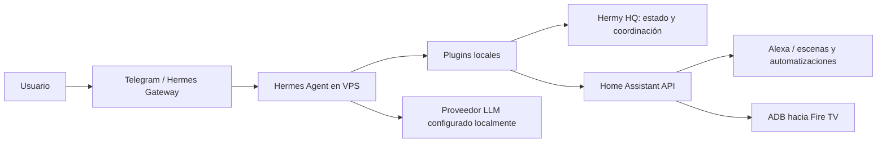

# Hermes Agent Personalizado

Banner del proyecto Hermes Agent, distribuido con el código fuente de [Nous Research](https://github.com/NousResearch/hermes-agent). La marca y el diseño pertenecen a sus titulares.

Repositorio público del despliegue de Hermes Agent que se ejecuta en un VPS, publicado desde el estado activo del servidor. Contiene el código fuente completo versionado de Hermes Agent, las personalizaciones locales activas, plugins propios y ejemplos portables de configuración e instalación.

## Mapa visual de la integración

La ilustración resume visualmente el ecosistema. El diagrama Mermaid y las secciones siguientes describen los flujos implementados con etiquetas precisas.

## Qué incluye

- Árbol del proyecto Hermes Agent (rama activa exportada como un commit nuevo, sin historial previo).
- Plugins propios para Alexa, presencia en red, enrutamiento, protecciones de herramientas, Hermy HQ, QBitTorrent y servicios personalizados.
- Las dos modificaciones locales activas del gateway y su prueba asociada.
- Ejemplos de configuración y unidades de servicio, revisados para publicar sin credenciales.
- Integración conceptual con Hermy HQ y Home Assistant; ADB para control de Fire TV se documenta y se comparte en el repositorio de Home Assistant.

## Arquitectura

El diagrama describe las integraciones configuradas en este despliegue; los proveedores y endpoints se configuran en el servidor. No hay tokens ni direcciones privadas en este repo.

## Proyectos relacionados

- [Home Assistant Personalized](https://github.com/Reynaldo8509/home-assistant-personalized)
- [Hermy HQ Personalized](https://github.com/Reynaldo8509/hermy-hq-personalized)

## Inicio

Consulta `docs/DEPLOYMENT.md` para dependencias, instalación del código y plugins, configuración local y comprobaciones de operación. `custom/plugins/` contiene las personalizaciones extraídas del directorio activo de plugins del VPS.

## Seguridad y alcance

No se publican archivos `.env`, claves, secretos, historiales de conversación, estados de agentes, bases de datos, cachés, credenciales OAuth ni configuración privada. Los servicios de producción continúan instalados en el VPS. Este repositorio no restaura datos de runtime. Revisa `SECURITY.md` antes de aportar cambios.

El código base conserva sus avisos y licencia originales. Las personalizaciones se publican como documentación de portafolio y ejemplos de integración.
